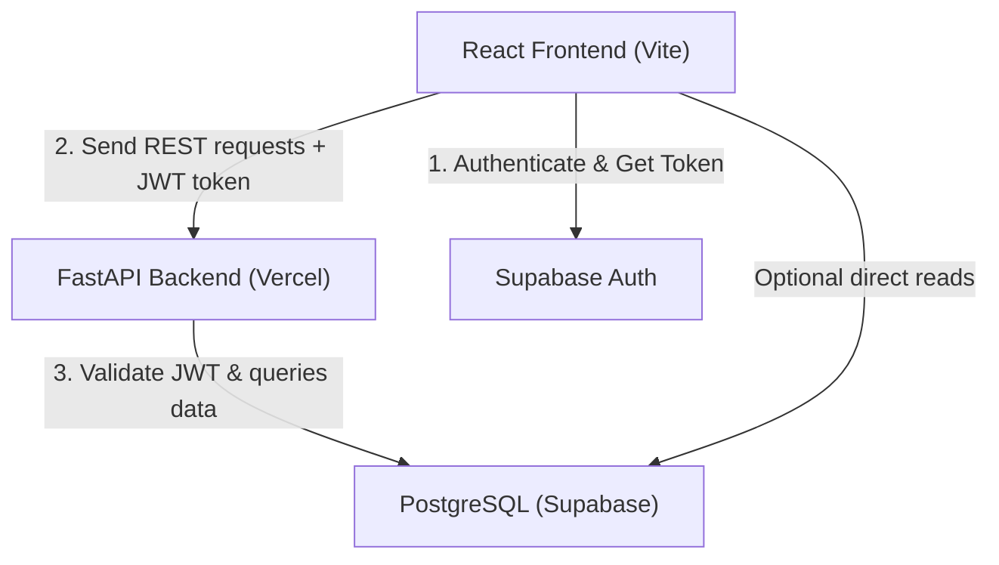
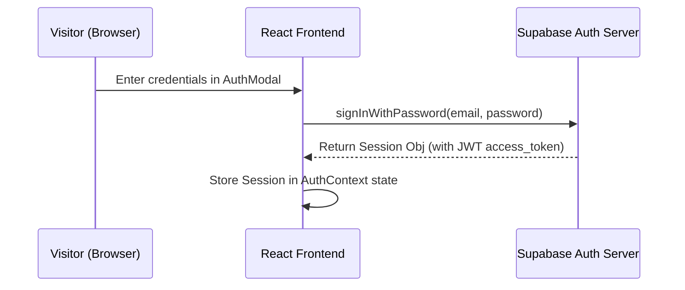
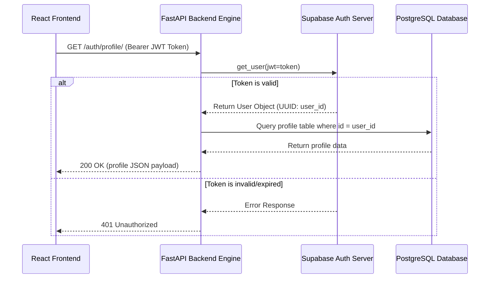

# Architectural Design & Decoupling

This document describes the high-level system architecture, client-server decoupling, authentication strategy, data structures, and database security rules of the **Mystery Lab** platform.

---

## 🏗️ System Overview

The platform uses a decoupled client-server architecture consisting of:
1. **React Single Page Application (SPA)**: Serves as the interactive landing page and client shell, written in TypeScript and styled using Tailwind CSS and Framer Motion.
2. **FastAPI Backend Engine**: Serves as a stateless REST service that processes client requests, handles validation schemas via Pydantic, and interacts with the database.
3. **Supabase Cloud Engine**: Manages user authentication (Supabase Auth) and relational tables (PostgreSQL) secured by Row Level Security (RLS) policies.



---

## 👥 Authentication & Authorization Flows

### Sign In & Token Issuance Flow


### Authenticated Request Validation Flow


---

## 🛡️ Database Schema & Security Layer

The database contains 10 primary tables configured in [supabase_schema.sql](file:///Users/legend27648/agy-cli-projects/Mystery-Lab/migrations/supabase_schema.sql):

### Security Policies & Row Level Security (RLS)
PostgreSQL's Row Level Security is active across all tables, ensuring strict data isolation. 

To determine administrative access, we define a helper function `is_admin(user_id)` inside the database:
```sql
CREATE OR REPLACE FUNCTION is_admin(user_id uuid)
RETURNS boolean AS $$
BEGIN
    RETURN EXISTS (SELECT 1 FROM admins WHERE admins.user_id = $1);
END;
$$ LANGUAGE plpgsql SECURITY DEFINER;
```

This helper function runs with `SECURITY DEFINER` privileges (similar to setuid), allowing standard users to query their authorization level against the protected `admins` table securely.
